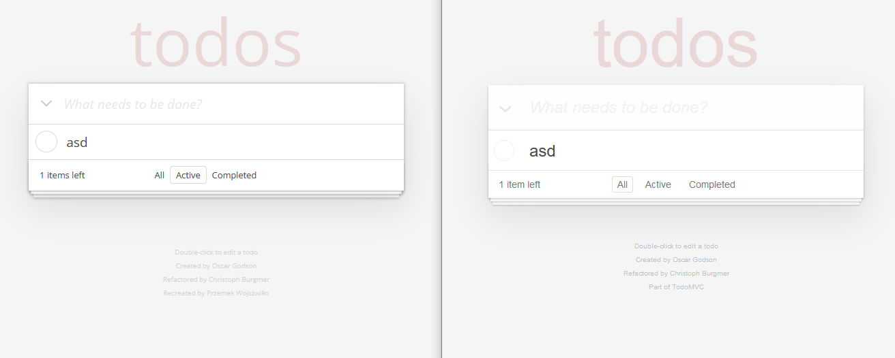
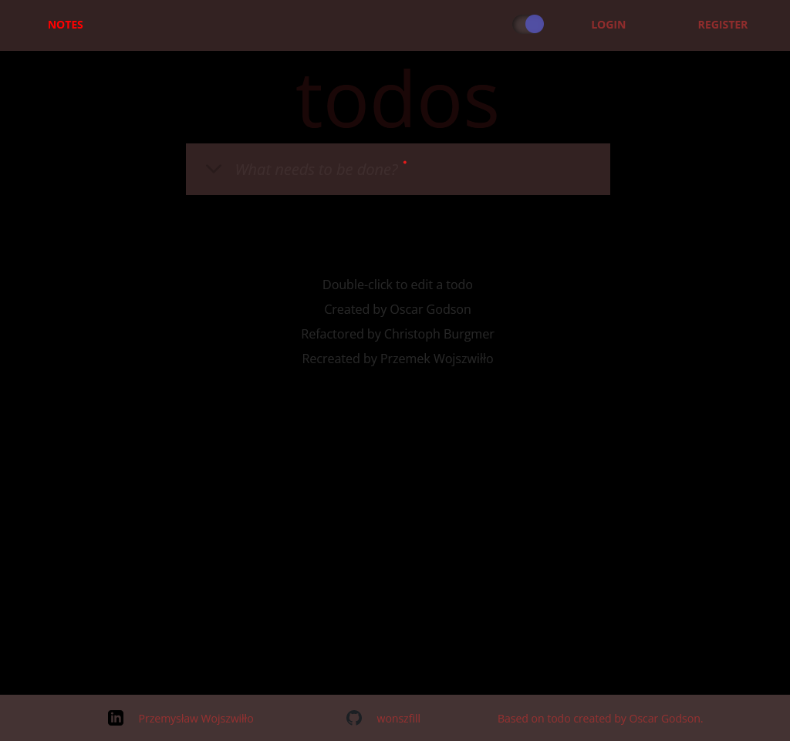
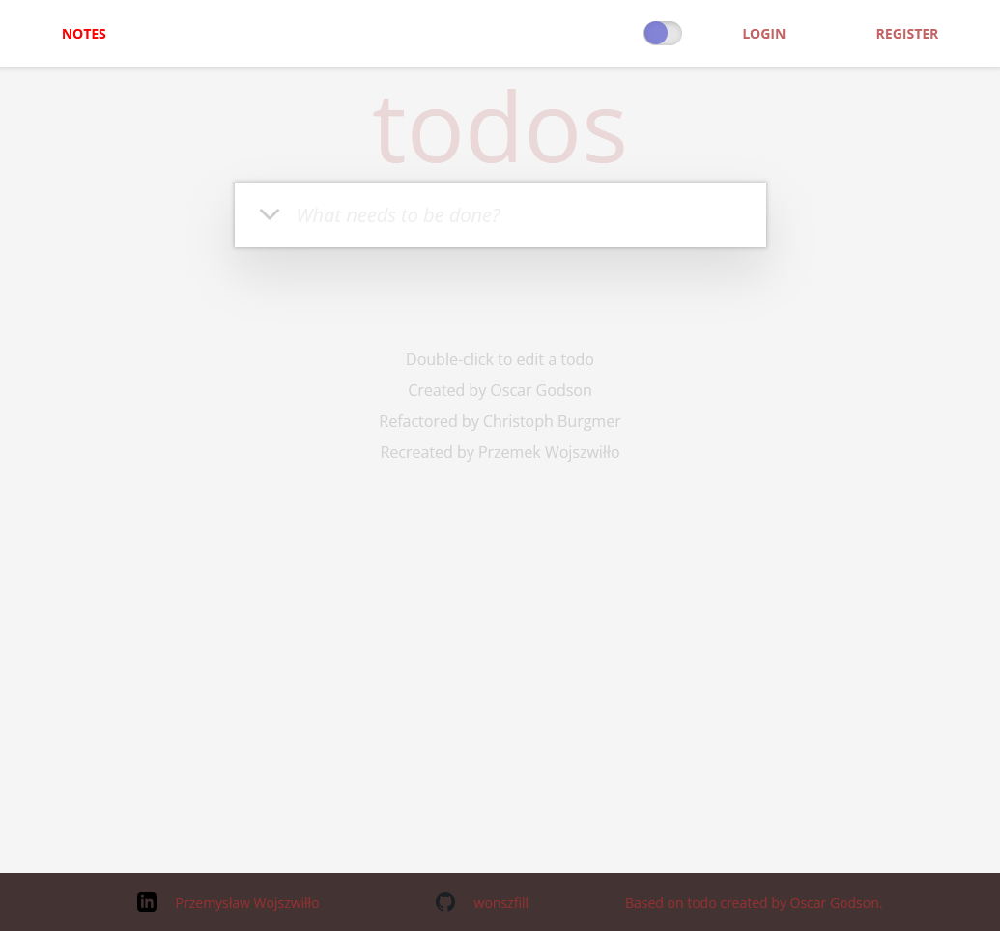
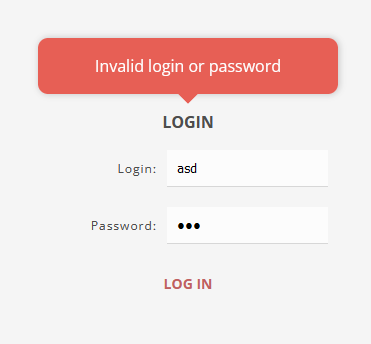
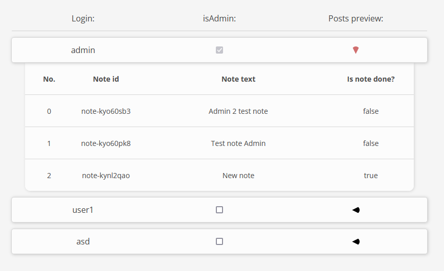
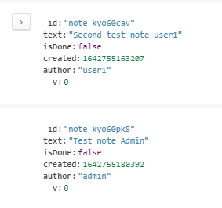

# ToDo recreation

Frontend react app paired with node.js/express backend storing data on MongoDB community (locally). Based on [original todo.](https://todomvc.com/examples/vanillajs/#/)

## Table of contents
- [Tech stack](#tech-stack)
- [Main features](#main-features)
    - [Notes](#notes)
    - [User experience](#user-experience)
    - [Authentication](#authentication)
    - [Admin panel](#admin-panel)
    - [Database](#database)
- [My process](#my-process)
- [Author](#author)

# Tech stack

## Frontend
- React (hooks) + styled components, react router, context api, react animation group

## Backend
- Node.js + Express, Mongoose, JSON Web Token, Bcrypt, cookie parser, cors
- MongoDB Community

# Main features

## Notes

Notes are stored in MongoDB. User can display, edit, delete and mark his notes as done/undone, as well as create new ones.
It is possible to filter notes by completion.

Backend server is set up in a way that fits the frontend use. I.e. it can handle deleting or patching multiple records with one fetch request.

## User experience

User can adjust the site to his taste. The transition between themes happens smoothly without unpleasant flashing.
User experience is enhanced with react animations from react animation group lib.

 

## Authentication

Username and password are verified on server side. After succesful login the user is provided with JSON Web Token cookie, which is set to http only. Frontend app stores user data provided with login fetch response (isAdmin flag, username) and updates updates that info with every user action, as JWT is verified on all endpoints.
When frontend receives 4xx response it changes user login state, changing his view permissions. 
If user would work around this the server would still need JWT to provide the data.

## Admin panel

Users with admin permissions are able to view custom panel, that allows to list all users and preview posts they authored. It is possible to toggle if user is admin, and also on the server side it is blocked for certain user to revoke admin permission from self 😉.
Link to admin panel is conditionally rendered in navigation bar.

## Database

Communicating with DB happens with mongoose. The passwords are encrypted with Bcrypt library.

# My process

First I set up basic react up, that held everything in state. It was clone of the todo I mentioned in the beginning.
Second I added storing the data to localstorage, as to preserve the data somewhere. 
Next step was adding JSON Server to keep the data, but still it was without authentication.
Finally I added mongoDB with users and permissions. After I managed to combine all the parts to worked together I fixed the stylings and added animations, transition and other visual enhancements.

# Author

Przemysław Wojszwiłło
- [LinkedIn](https://www.linkedin.com/in/przemys%C5%82aw-wojszwi%C5%82%C5%82o/)
- [GitHub](https://github.com/wonszfill)

Main feature based on [ToDo](https://todomvc.com/examples/vanillajs/#/)

